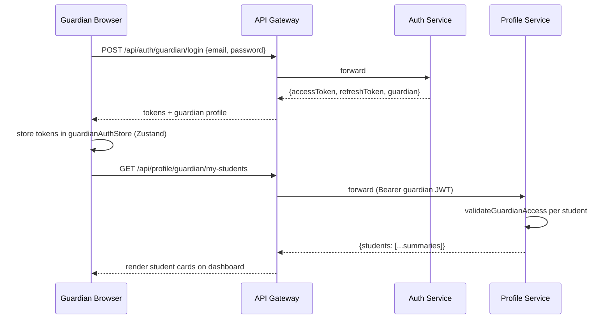
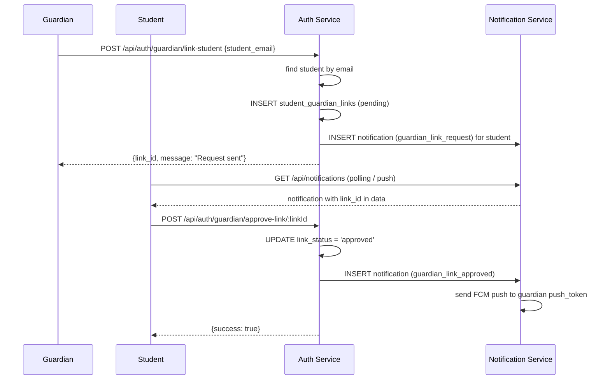
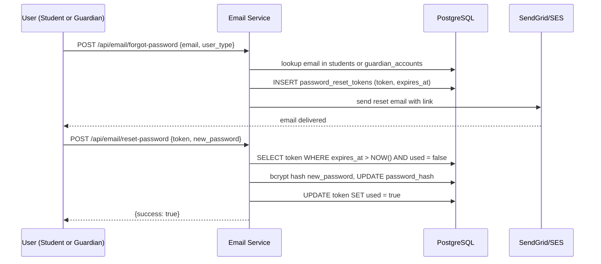
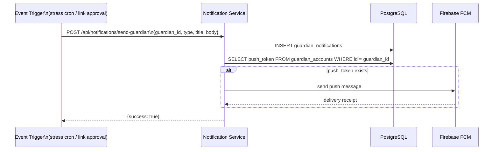

# Design Document: Guardian Portal for MindTwin AI

## Overview

The Guardian Portal extends MindTwin AI to give parents and teachers a dedicated, read-only window into their linked students' learning activity. Guardians register and log in through a separate auth flow (already implemented in the backend), then use a purpose-built React dashboard to monitor progress, stress, exam readiness, and weekly summaries. The portal also adds email-based password reset for both user types and push notifications directed at guardians when significant student events occur.

The feature is entirely additive: it builds on top of the existing `guardian_accounts`, `student_guardian_links`, and `guardian_access_logs` tables (migration 016), the guardian endpoints already live in the auth-service and profile-service, and the notification-service already handles student-scoped push tokens. New work is limited to (1) frontend guardian screens, (2) two new DB migrations (guardian push tokens + password-reset tokens), (3) email-service integration for password reset, and (4) guardian-scoped push notification delivery in the notification-service.

---

## Architecture

```mermaid
graph TD
    subgraph Frontend ["Frontend (React + Vite + TailwindCSS v4)"]
        GL[Guardian Login / Register]
        GD[Guardian Dashboard]
        GSP[Student Profile View]
        LR[Link-Request UI]
        FP[Forgot Password Flow]
        SN[Student Notification Panel\n(approve / reject links)]
    end

    subgraph Gateway ["API Gateway / Nginx"]
        GW[Reverse Proxy]
    end

    subgraph Backend ["Backend Microservices (Node/Express)"]
        AS[Auth Service :3001\n/api/auth/*]
        PS[Profile Service :3003\n/api/profile/guardian/*]
        NS[Notification Service :3007\n/api/notifications/*]
        ES[Email Service :3008\n/api/email/*  NEW]
    end

    subgraph External ["External Providers"]
        SG[SendGrid / AWS SES]
        FCM[Firebase FCM / APNS]
    end

    subgraph DB ["PostgreSQL + Redis"]
        PG[(PostgreSQL)]
        RD[(Redis)]
    end

    GL -->|POST /api/auth/guardian/login| GW
    GD -->|GET /api/profile/guardian/my-students| GW
    GSP -->|GET /api/profile/guardian/student/:id/overview| GW
    LR -->|POST /api/auth/guardian/link-student| GW
    FP -->|POST /api/email/forgot-password| GW
    SN -->|POST /api/auth/guardian/approve-link/:id| GW

    GW --> AS
    GW --> PS
    GW --> NS
    GW --> ES

    AS --> PG
    AS --> RD
    PS --> PG
    NS --> PG
    NS --> FCM
    ES --> PG
    ES --> SG
```

---

## Sequence Diagrams

### Guardian Login & Dashboard Load



### Link-Request Flow



### Password Reset Flow



### Guardian Push Notification Delivery



---

## Components and Interfaces

### Frontend Components

#### GuardianAuthStore (Zustand)

**Purpose**: Mirrors `useAuthStore` but for guardian sessions. Stores guardian JWT, profile, and persists to localStorage.

**Interface**:
```typescript
interface GuardianAuthState {
  guardian: Guardian | null
  accessToken: string | null
  isAuthenticated: boolean
  login(credentials: { email: string; password: string }): Promise<void>
  register(data: GuardianRegisterPayload): Promise<void>
  logout(): void
  setAccessToken(token: string): void
}
```

**Responsibilities**:
- Persist guardian session across page reloads (Zustand `persist` middleware)
- Expose `isAuthenticated` flag for `GuardianProtectedRoute`
- Handle token refresh via the shared axios interceptor (guardian refresh tokens already supported by `/api/auth/refresh`)

---

#### GuardianProtectedRoute

**Purpose**: Route guard that redirects unauthenticated guardians to `/guardian/login`.

**Interface**:
```typescript
interface GuardianProtectedRouteProps {
  children: React.ReactNode
}
```

---

#### GuardianDashboard (page)

**Purpose**: Landing page after guardian login. Shows a grid of linked student cards with quick-stats.

**Interface**:
```typescript
interface StudentSummaryCard {
  id: string
  name: string
  grade_level: string
  board: string
  this_week: { sessions_done: number; sessions_planned: number; completion_rate: number }
  latest_stress: { score: number; severity: string } | null
  token_balance: number
  last_active: string | null
}
```

**Responsibilities**:
- Fetch `/api/profile/guardian/my-students` via React Query
- Render `StudentCard` components in a responsive grid
- Show empty state with "Link a Student" CTA when no students linked
- Provide navigation to per-student detail view

---

#### StudentDetailView (page)

**Purpose**: Full detail page for a single linked student. Tabs: Overview, Performance, Weekly Summary, Exam Readiness.

**Responsibilities**:
- Tab 1 — Overview: stress status, streak, upcoming exams, session stats
- Tab 2 — Performance: subject breakdown table + `PerformanceTrendChart`
- Tab 3 — Weekly Summary: highlights/concerns list, session done/missed, quiz avg
- Tab 4 — Exam Readiness: readiness score cards per subject with progress bars

---

#### PerformanceTrendChart

**Purpose**: Recharts `LineChart` showing theta trend per subject over time.

**Interface**:
```typescript
interface PerformanceTrendChartProps {
  subjects: SubjectPerformance[]  // from /performance endpoint
  period: 'week' | 'month' | 'all_time'
  onPeriodChange(p: string): void
}
```

---

#### StressTimelineChart

**Purpose**: Recharts `AreaChart` showing stress score over the selected period.

**Interface**:
```typescript
interface StressTimelineChartProps {
  data: Array<{ date: string; score: number; severity: string }>
}
```

---

#### LinkStudentModal

**Purpose**: Modal form where guardian enters a student email to send a link request.

**Interface**:
```typescript
interface LinkStudentModalProps {
  open: boolean
  onClose(): void
  onSuccess(linkId: string): void
}
```

**Responsibilities**:
- Input validation (valid email format)
- POST to `/api/auth/guardian/link-student`
- Show success/error feedback inline

---

#### StudentNotificationPanel (extension to existing Dashboard)

**Purpose**: Extends the existing notification bell in `Dashboard.jsx` to surface guardian link requests with Approve/Reject action buttons inline.

**Responsibilities**:
- Detect notifications of type `guardian_link_request` in the existing notifications list
- Render inline Approve / Reject buttons that call `/api/auth/guardian/approve-link/:linkId` and `/api/auth/guardian/reject-link/:linkId`
- Refetch notifications after action

---

#### ForgotPasswordPage / ResetPasswordPage

**Purpose**: Two-step email-based password reset flow accessible from both student and guardian login pages.

**Responsibilities**:
- `ForgotPasswordPage`: email input + user_type selector (student / guardian), POST to `/api/email/forgot-password`
- `ResetPasswordPage`: reads `?token=` from URL, new password form, POST to `/api/email/reset-password`

---

### Backend Components

#### Email Service (new microservice)

**Purpose**: Handles password reset token generation and email dispatch via SendGrid or AWS SES.

**Interface**:
```typescript
// POST /api/email/forgot-password
interface ForgotPasswordRequest {
  email: string
  user_type: 'student' | 'guardian'
}

// POST /api/email/reset-password
interface ResetPasswordRequest {
  token: string
  new_password: string
}
```

**Responsibilities**:
- Generate a cryptographically random reset token (32 bytes hex)
- Store token in `password_reset_tokens` table with 1-hour TTL
- Send templated email via SendGrid/SES
- On reset: verify token validity, bcrypt-hash new password, update the correct table, mark token used

---

#### Notification Service Extensions

**New endpoints**:
- `POST /api/notifications/send-guardian` — internal endpoint to store a guardian notification and fire FCM push
- `POST /api/notifications/guardian/register-token` — guardian registers their FCM push token
- `GET /api/notifications/guardian` — guardian fetches their own notifications

**Responsibilities**:
- Store guardian notifications in new `guardian_notifications` table
- Read `guardian_accounts.push_token` and dispatch FCM message when token present
- Trigger guardian push on: link approved, high stress detected (from stress cron), exam approaching (from scheduler cron)

---

## Data Models

### Migration 017 — guardian push token + guardian notifications

```sql
-- Add push_token to guardian_accounts (mirrors students.push_token)
ALTER TABLE guardian_accounts ADD COLUMN push_token VARCHAR(255);

-- Guardian-scoped notifications (separate from student notifications)
CREATE TABLE IF NOT EXISTS guardian_notifications (
    id          UUID PRIMARY KEY DEFAULT gen_random_uuid(),
    guardian_id UUID NOT NULL REFERENCES guardian_accounts(id) ON DELETE CASCADE,
    student_id  UUID REFERENCES students(id) ON DELETE SET NULL,
    type        VARCHAR(50),
    title       VARCHAR(255),
    body        TEXT,
    data        JSONB,
    read        BOOLEAN DEFAULT FALSE,
    created_at  TIMESTAMP DEFAULT CURRENT_TIMESTAMP
);

CREATE INDEX idx_guardian_notifications_guardian_id ON guardian_notifications(guardian_id);
CREATE INDEX idx_guardian_notifications_created_at  ON guardian_notifications(created_at);
```

### Migration 018 — password reset tokens

```sql
CREATE TABLE IF NOT EXISTS password_reset_tokens (
    id         UUID PRIMARY KEY DEFAULT gen_random_uuid(),
    token      VARCHAR(128) UNIQUE NOT NULL,
    user_type  VARCHAR(20) NOT NULL CHECK (user_type IN ('student', 'guardian')),
    user_id    UUID NOT NULL,
    expires_at TIMESTAMP NOT NULL,
    used       BOOLEAN DEFAULT FALSE,
    created_at TIMESTAMP DEFAULT CURRENT_TIMESTAMP
);

CREATE INDEX idx_prt_token    ON password_reset_tokens(token);
CREATE INDEX idx_prt_user_id  ON password_reset_tokens(user_id);
```

### Guardian (existing, extended)

```typescript
interface Guardian {
  id: string           // UUID
  name: string
  email: string
  role: 'parent' | 'teacher'
  institution_name: string | null
  push_token: string | null   // NEW — migration 017
  created_at: string
}
```

### GuardianNotification

```typescript
interface GuardianNotification {
  id: string
  guardian_id: string
  student_id: string | null
  type: 'link_approved' | 'high_stress' | 'exam_approaching' | 'general'
  title: string
  body: string
  data: Record<string, unknown>
  read: boolean
  created_at: string
}
```

### PasswordResetToken

```typescript
interface PasswordResetToken {
  id: string
  token: string          // 64-char hex
  user_type: 'student' | 'guardian'
  user_id: string
  expires_at: string     // NOW() + 1 hour
  used: boolean
  created_at: string
}
```

---

## Algorithmic Pseudocode

### Guardian Dashboard Data Load

```pascal
PROCEDURE loadGuardianDashboard(guardian_id)
  INPUT: guardian_id (UUID from JWT)
  OUTPUT: dashboard state

  SEQUENCE
    // Parallel fetch via React Query useQueries
    [studentsResult, notifResult] ← PARALLEL(
      GET /api/profile/guardian/my-students,
      GET /api/notifications/guardian
    )

    IF studentsResult.isError THEN
      DISPLAY error state with retry button
      RETURN
    END IF

    students ← studentsResult.data.students
    notifications ← notifResult.data.notifications

    FOR each student IN students DO
      RENDER StudentCard(student)
    END FOR

    IF students.length = 0 THEN
      RENDER EmptyState with LinkStudentButton
    END IF
  END SEQUENCE
END PROCEDURE
```

### Link Student Request

```pascal
PROCEDURE sendLinkRequest(guardian_id, student_email)
  INPUT: guardian_id, student_email
  OUTPUT: link_id or error

  PRECONDITION: student_email is valid email format
  PRECONDITION: guardian is authenticated

  SEQUENCE
    // Backend: POST /api/auth/guardian/link-student
    student ← db.findStudentByEmail(student_email)

    IF student IS NULL THEN
      RETURN Error("Student not found with that email")
    END IF

    existing ← db.findLink(student.id, guardian_id)

    IF existing IS NOT NULL THEN
      RETURN Error("Link already exists: " + existing.link_status)
    END IF

    link_id ← db.insertLink(student.id, guardian_id, status='pending')

    // Notify student in-app
    db.insertNotification(
      student_id = student.id,
      type       = 'guardian_link_request',
      title      = roleLabel + " access request",
      body       = guardian.name + " wants to view your progress. Approve?",
      data       = { link_id, guardian_id, role }
    )

    RETURN Success(link_id)
  END SEQUENCE

  POSTCONDITION: student_guardian_links row exists with status='pending'
  POSTCONDITION: student has a new unread notification
END PROCEDURE
```

### Password Reset — Request Token

```pascal
PROCEDURE requestPasswordReset(email, user_type)
  INPUT: email (string), user_type ('student' | 'guardian')
  OUTPUT: void (always returns 200 to prevent email enumeration)

  PRECONDITION: email is valid format
  PRECONDITION: user_type IN ('student', 'guardian')

  SEQUENCE
    table ← IF user_type = 'student' THEN 'students' ELSE 'guardian_accounts'
    user  ← db.findByEmail(table, email)

    IF user IS NULL THEN
      // Silent success — do not reveal whether email exists
      RETURN Success()
    END IF

    // Invalidate any existing unused tokens for this user
    db.markExistingTokensUsed(user.id, user_type)

    token     ← crypto.randomBytes(32).toString('hex')  // 64-char hex
    expiresAt ← NOW() + 1 hour

    db.insertPasswordResetToken(token, user_type, user.id, expiresAt)

    resetUrl ← APP_URL + "/reset-password?token=" + token
    emailProvider.send(
      to      = email,
      subject = "Reset your MindTwin password",
      html    = renderResetTemplate(user.name, resetUrl)
    )

    RETURN Success()
  END SEQUENCE

  POSTCONDITION: password_reset_tokens row exists with used=false
  POSTCONDITION: reset email dispatched (or silently skipped if user not found)
END PROCEDURE
```

### Password Reset — Apply New Password

```pascal
PROCEDURE applyPasswordReset(token, new_password)
  INPUT: token (string), new_password (string)
  OUTPUT: success or error

  PRECONDITION: token is non-empty string
  PRECONDITION: new_password length >= 8

  SEQUENCE
    tokenRow ← db.query(
      "SELECT * FROM password_reset_tokens
       WHERE token = $1 AND used = false AND expires_at > NOW()",
      [token]
    )

    IF tokenRow IS NULL THEN
      RETURN Error("Token is invalid or has expired")
    END IF

    salt         ← bcrypt.genSalt(12)
    password_hash ← bcrypt.hash(new_password, salt)

    table ← IF tokenRow.user_type = 'student' THEN 'students' ELSE 'guardian_accounts'
    db.update(table, { password_hash }, WHERE id = tokenRow.user_id)

    db.update('password_reset_tokens', { used: true }, WHERE id = tokenRow.id)

    RETURN Success("Password updated")
  END SEQUENCE

  POSTCONDITION: user's password_hash updated in correct table
  POSTCONDITION: token.used = true (cannot be reused)
END PROCEDURE
```

### Guardian Push Notification Dispatch

```pascal
PROCEDURE sendGuardianPush(guardian_id, type, title, body, data)
  INPUT: guardian_id, type, title, body, data
  OUTPUT: void

  SEQUENCE
    // Persist notification regardless of push token
    db.insertGuardianNotification(guardian_id, type, title, body, data)

    guardian ← db.query(
      "SELECT push_token FROM guardian_accounts WHERE id = $1",
      [guardian_id]
    )

    IF guardian.push_token IS NOT NULL THEN
      fcm.send({
        token: guardian.push_token,
        notification: { title, body },
        data: data
      })
    END IF
  END SEQUENCE

  POSTCONDITION: guardian_notifications row inserted
  POSTCONDITION: FCM push sent IF push_token present
END PROCEDURE
```

---

## Key Functions with Formal Specifications

### guardianApi.getMyStudents()

```typescript
function getMyStudents(): Promise<MyStudentsResponse>
```

**Preconditions:**
- Guardian JWT present in Authorization header
- JWT contains valid `guardian_id`

**Postconditions:**
- Returns array of student summaries for all approved links
- Each summary includes `this_week`, `latest_stress`, `token_balance`, `last_active`
- Access logged to `guardian_access_logs` for each student

**Loop Invariants:**
- For each student in the result, `link_status = 'approved'` was verified before inclusion

---

### useGuardianStudentDetail(studentId, tab)

```typescript
function useGuardianStudentDetail(
  studentId: string,
  tab: 'overview' | 'performance' | 'weekly' | 'exam'
): QueryResult
```

**Preconditions:**
- `studentId` is a valid UUID
- Guardian has an approved link to this student (enforced server-side)

**Postconditions:**
- Returns data for the active tab only (lazy loading — other tabs not fetched until selected)
- On 403 response, redirects guardian back to dashboard with error toast

**Loop Invariants:** N/A (single fetch per tab activation)

---

### validateResetToken(token)

```typescript
function validateResetToken(token: string): Promise<TokenValidationResult>
```

**Preconditions:**
- `token` is a 64-character hex string

**Postconditions:**
- Returns `{ valid: true, user_type, user_id }` if token exists, unused, and not expired
- Returns `{ valid: false, reason }` otherwise
- Does not mutate any state (read-only check)

---

## Example Usage

```typescript
// 1. Guardian login and store setup
const { login } = useGuardianAuthStore()
await login({ email: 'parent@example.com', password: 'secret' })
// → stores accessToken + guardian in Zustand, persisted to localStorage

// 2. Fetch linked students on dashboard mount
const { data } = useQuery({
  queryKey: ['guardian-students'],
  queryFn: guardianApi.getMyStudents,
  staleTime: 60_000,
})
// → renders StudentCard grid

// 3. Send link request from modal
const result = await guardianApi.linkStudent({ student_email: 'alice@school.edu' })
// → { link_id: 'uuid', message: 'Request sent to student' }

// 4. Student approves link from notification panel
await authApi.approveLink(linkId)
// → guardian receives FCM push: "Alice approved your access request"

// 5. Guardian views student performance with period filter
const perf = await guardianApi.getStudentPerformance(studentId, 'month')
// → { subjects: [...], overall_trend: 'improving', strongest_subject: 'Physics' }

// 6. Password reset request
await emailApi.forgotPassword({ email: 'parent@example.com', user_type: 'guardian' })
// → email sent with reset link (silent success even if email not found)

// 7. Apply reset
await emailApi.resetPassword({ token: tokenFromUrl, new_password: 'newSecret123' })
// → { success: true, message: 'Password updated' }

// 8. Guardian registers push token
await guardianApi.registerPushToken({ push_token: 'ExponentPushToken[...]' })
// → { success: true }
```

---

## Correctness Properties

- For all guardian requests to profile endpoints, the response MUST only contain data for students where `student_guardian_links.link_status = 'approved'` and `guardian_id` matches the JWT claim.
- For all password reset token lookups, a token MUST be rejected if `used = true` OR `expires_at <= NOW()`, preventing replay attacks.
- For all link-request operations, if a link already exists between a guardian and student (any status), a duplicate insert MUST be rejected with HTTP 409.
- For all guardian push notifications, the notification row MUST be persisted to `guardian_notifications` before any FCM dispatch attempt, ensuring delivery tracking even if FCM fails.
- For all forgot-password requests, the HTTP response MUST be 200 regardless of whether the email exists in the database, preventing email enumeration.
- For all guardian JWT verifications, tokens containing only `student_id` (no `guardian_id`) MUST be rejected with HTTP 403 on guardian-protected routes.
- For all chart data rendered in `PerformanceTrendChart`, the theta values MUST be clamped to the range [-3, 3] before normalisation to 0–100 to prevent display overflow.

---

## Error Handling

### Scenario 1: Guardian accesses student without approved link

**Condition**: Guardian JWT is valid but `student_guardian_links` has no approved row for the (guardian_id, student_id) pair.
**Response**: HTTP 403 `{ success: false, error: "Access denied: no approved link to this student" }`
**Recovery**: Frontend catches 403, shows toast "You don't have access to this student", redirects to dashboard.

### Scenario 2: Student email not found during link request

**Condition**: Guardian submits an email that doesn't exist in `students`.
**Response**: HTTP 404 `{ success: false, error: "Student not found with that email" }`
**Recovery**: `LinkStudentModal` shows inline error message; form remains open for correction.

### Scenario 3: Password reset token expired or already used

**Condition**: User clicks a reset link after 1 hour or after already resetting.
**Response**: HTTP 400 `{ success: false, error: "Token is invalid or has expired" }`
**Recovery**: `ResetPasswordPage` shows error with a link back to `/forgot-password` to request a new token.

### Scenario 4: FCM push delivery failure

**Condition**: FCM returns an error (invalid token, app uninstalled, network issue).
**Response**: Error logged server-side; notification row already persisted in `guardian_notifications`.
**Recovery**: Guardian can still read notifications via `GET /api/notifications/guardian` on next app open. Stale FCM tokens should be cleared from `guardian_accounts.push_token` on repeated delivery failures.

### Scenario 5: Email provider failure during password reset

**Condition**: SendGrid/SES returns a non-2xx response.
**Response**: HTTP 500 `{ success: false, error: "Failed to send reset email. Please try again." }`
**Recovery**: The `password_reset_tokens` row is rolled back (or marked used) so the user can retry. Frontend shows the error and keeps the form active.

---

## Testing Strategy

### Unit Testing Approach

Test each backend controller function in isolation with mocked `db` and `redisClient`:
- `requestPasswordReset`: verify token insertion, email dispatch call, silent success on unknown email
- `applyPasswordReset`: verify token validation logic (expired, used, valid), password hash update
- `sendGuardianPush`: verify notification insert always happens, FCM called only when push_token present
- `validateGuardianAccess`: verify 403 thrown when no approved link exists

### Property-Based Testing Approach

**Property Test Library**: fast-check

Key properties to test:
- For any `token` string that is not exactly 64 hex characters, `validateResetToken` returns `{ valid: false }`.
- For any guardian JWT payload missing `guardian_id`, `verifyGuardianAuth` middleware always returns 403.
- For any `theta` value in [-3, 3], the normalisation formula `((theta + 3) / 6) * 100` always produces a value in [0, 100].
- For any `readiness_score` computed by `getExamReadiness`, the result is always clamped to [0, 100].

### Integration Testing Approach

End-to-end flows using a test PostgreSQL database:
1. Guardian register → login → link-student → student approve → guardian fetch overview
2. Forgot password → token in DB → reset password → old password rejected → new password accepted
3. Guardian push token register → trigger high-stress event → verify `guardian_notifications` row + FCM mock called

---

## Performance Considerations

- `getMyStudentsSummary` runs N+1 queries per student (sessions, stress, tokens, last_active). For teachers with many students, this should be refactored to a single batch query using `UNNEST` or a lateral join. The existing pagination (`limit=20`) mitigates the immediate impact.
- Dashboard charts fetch data on tab activation (lazy), not on initial page load, keeping the first paint fast.
- React Query `staleTime` of 60s on guardian endpoints prevents redundant refetches during normal navigation.
- `guardian_access_logs` inserts are fire-and-forget (no `await`) to avoid adding latency to read responses.

---

## Security Considerations

- Guardian JWTs contain `{ guardian_id, role }` — the `verifyGuardianAuth` middleware rejects any token without `guardian_id`, preventing students from accessing guardian routes with their own tokens.
- All guardian profile endpoints call `validateGuardianAccess` before returning any student data, enforcing the approved-link requirement at the data layer, not just the route layer.
- Password reset tokens are single-use and expire in 1 hour. The forgot-password endpoint returns 200 regardless of email existence to prevent enumeration.
- Guardian push tokens are stored in `guardian_accounts.push_token` — not exposed in any API response to other users.
- The internal `POST /api/notifications/send-guardian` endpoint is protected by `x-api-key` header (same pattern as existing `sendNotification`), preventing external callers from injecting guardian notifications.
- `guardian_access_logs` provides a full audit trail of every data access, supporting compliance and privacy review.

---

## Dependencies

**Frontend (additions to existing package.json)**:
- `recharts` — chart library for performance trend, stress timeline, and study consistency charts (lightweight, React-native, no canvas dependency)

**Backend (new email-service)**:
- `@sendgrid/mail` or `@aws-sdk/client-ses` — email dispatch
- `crypto` (Node built-in) — secure token generation

**Backend (notification-service additions)**:
- `firebase-admin` — FCM push notification dispatch (already implied by existing `push_token` column on students)

**Infrastructure**:
- SendGrid API key or AWS SES credentials (environment variable `SENDGRID_API_KEY` / `AWS_SES_*`)
- Firebase service account JSON for FCM (environment variable `FIREBASE_SERVICE_ACCOUNT`)
- New environment variable `APP_URL` for constructing password reset links
